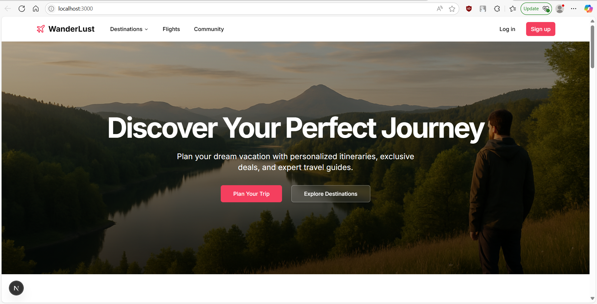
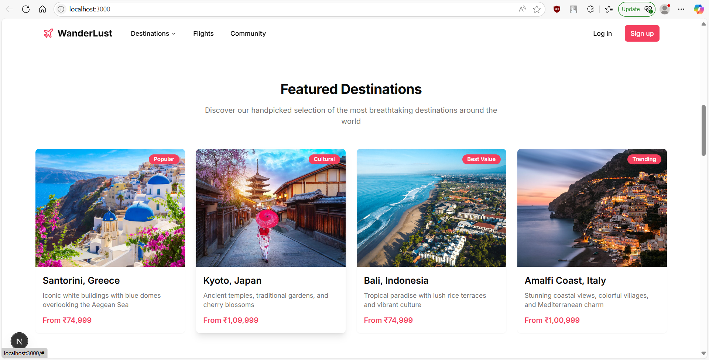
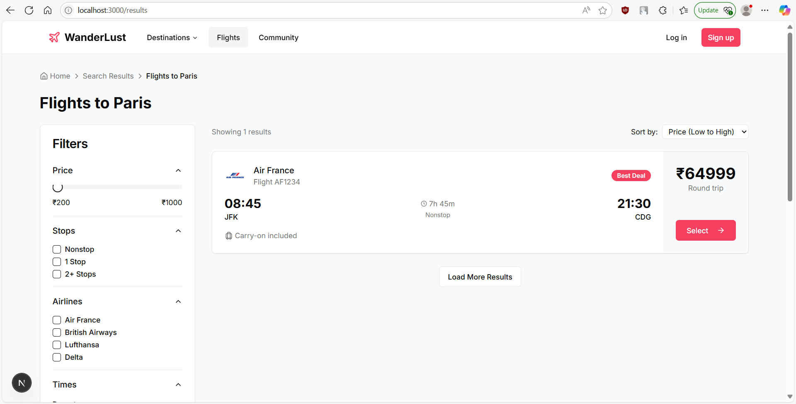

# WanderLust Travel Platform

A travel booking platform, built with Spring Boot backend and Next.js frontend.

## Project Structure
Planner/                            
├── backend/                        #Springboot (maven) backend
│   ├── src/
│   │   ├── main/
│   │   │   ├── java/com/wanderlust/
│   │   │   │   ├── config/          # App, DB, JWT, Security Config
│   │   │   │   ├── controller/      # REST Controllers (Auth, Destinations, Flights, etc.)
│   │   │   │   ├── dto/             # Data Transfer Objects grouped by domain
│   │   │   │   ├── model/           # Entity Models
│   │   │   │   ├── repository/      # Spring Data Repositories
│   │   │   │   ├── security/        # JWT & UserDetails Services
│   │   │   │   ├── service/         # Business Logic Services
│   │   │   │   └── WanderlustBackendApplication.java
│   │   └── resources/               # application.properties, templates, static assets
│   ├── target/                      # Compiled classes & build output
│   └── pom.xml                      # Maven config

├── frontend/                        #Next js frontend
│   ├── app/                         # Next.js app directory (routes, layouts)
│   ├── components/                 # UI & shared components (with shadcn/ui)
│   ├── lib/                         # API logic, auth context, utils
│   ├── public/                      # Static images (destinations, profiles, assets)
│   ├── styles/                      # Tailwind/global CSS
│   ├── hooks/                       # Custom React hooks
│   ├── next.config.mjs             # Next.js config
│   └── tailwind.config.ts          # Tailwind config

└── README.md


## Setup Instructions

### Backend Setup (Spring Boot + MySQL)

1. Navigate to the backend directory:
    cd backend

2. Configure database credentials:
- Open `src/main/resources/application.properties`
- Update the following settings with your MySQL credentials:
  ```properties
  spring.datasource.url=jdbc:mysql://localhost:3306/wanderlust?createDatabaseIfNotExist=true
  spring.datasource.username=YOUR_MYSQL_USERNAME
  spring.datasource.password=YOUR_MYSQL_PASSWORD
  ```

3. Run the application:
    mvn clean install
    mvn spring-boot

The backend will start on http://localhost:8080


### Frontend Setup (Next.js)

1. Navigate to the frontend directory:
    cd frontend

2. Install dependencies:
    npm install

    `if that didn't work try force installing by`
    npm install --legacy-peer-deps

3. Run the development server:
    npm run dev

The frontend will start on http://localhost:3000

## Testing

### Backend Testing with Postman

Test the endpoints with Postman:

1. Register: POST http://localhost:8080/api/auth/signup
2. Login: POST http://localhost:8080/api/auth/signin
3. Get Destinations: GET http://localhost:8080/api/destinations
4. Search Flights: POST http://localhost:8080/api/flights/search

### Default Credentials

Two default users are created on startup:
- Admin: username: `admin`, password: `admin123`
- Regular user: username: `user`, password: `user123`

## Screenshots

1. **Frontend Screenshots**:
- Homepage with search form




- Flight search results



2. **Backend Screenshots**:
- MySQL Workbench showing database tables


3. **API Testing Screenshots**:
- Postman authentication API (login/signup)


- Postman destinations API


    